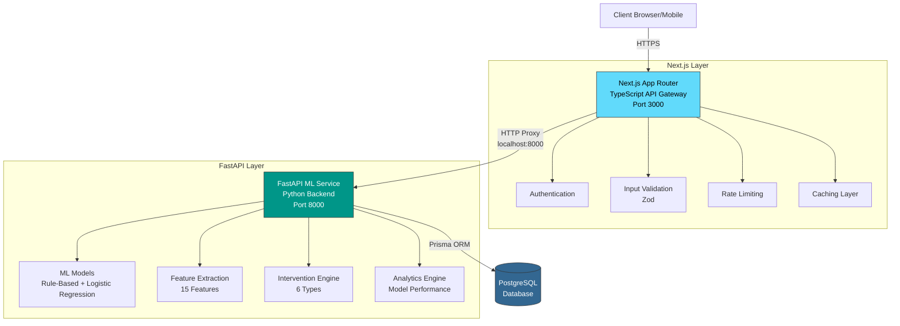
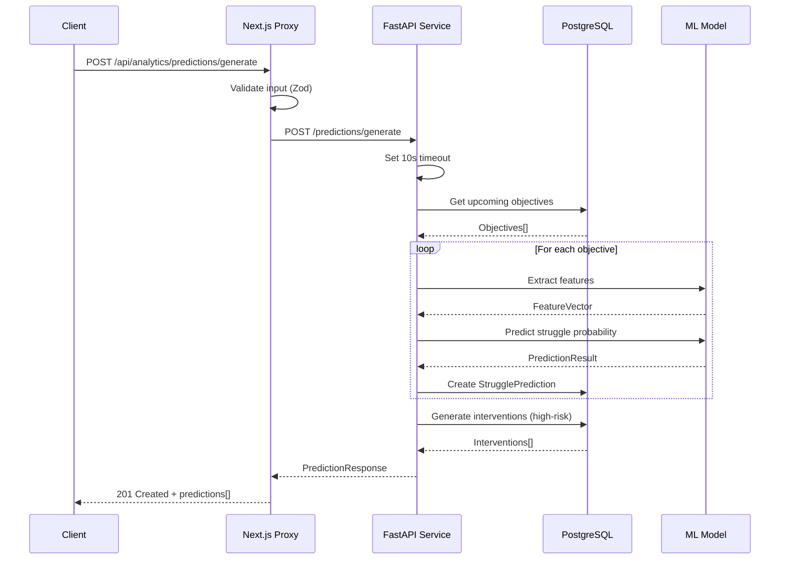
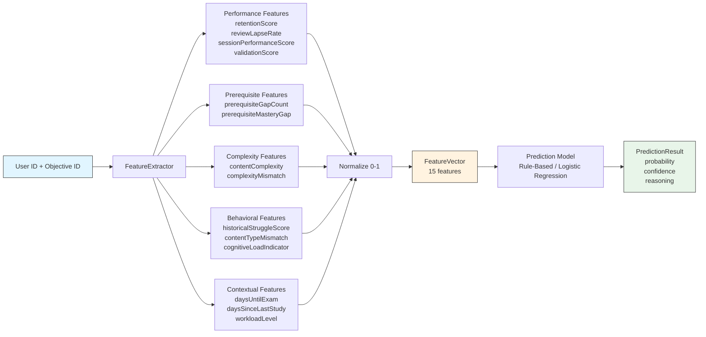
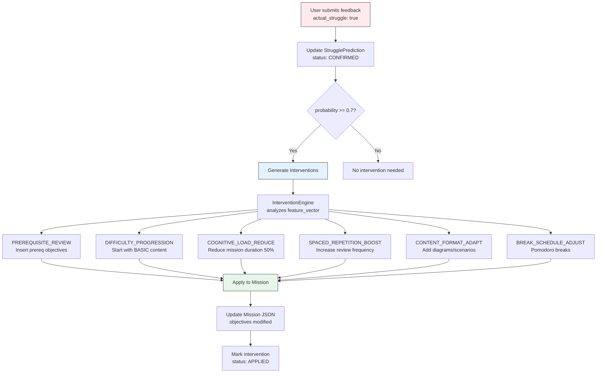
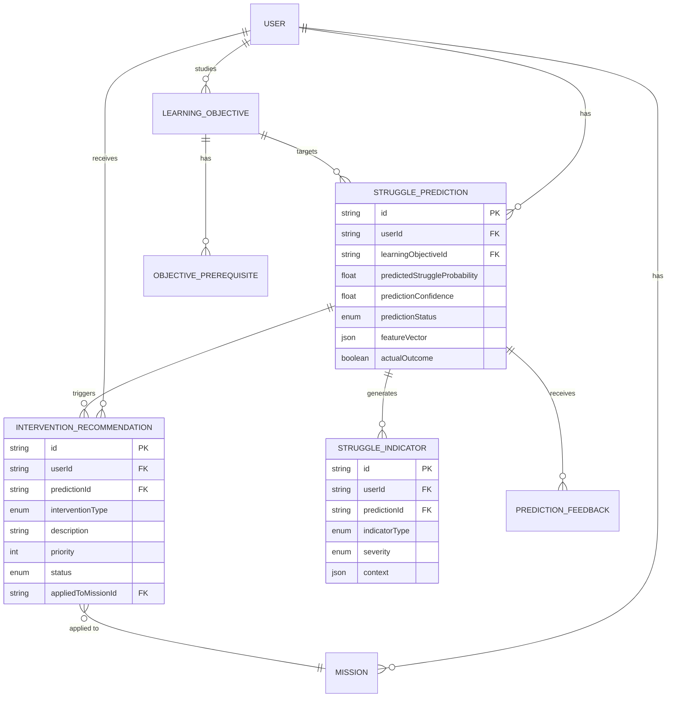
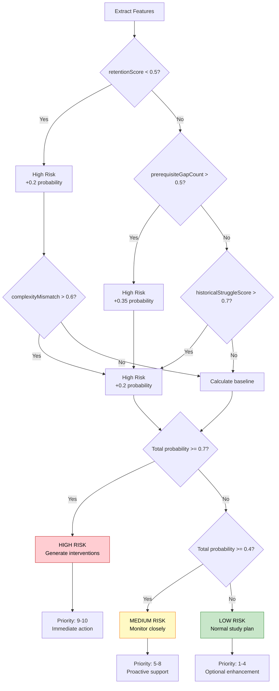
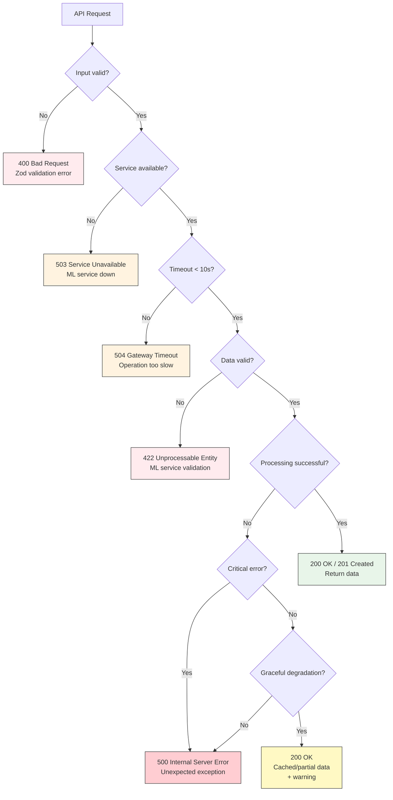
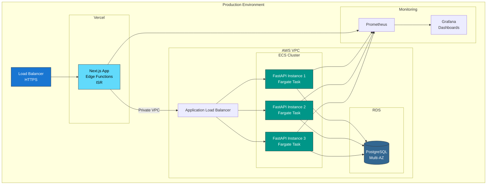
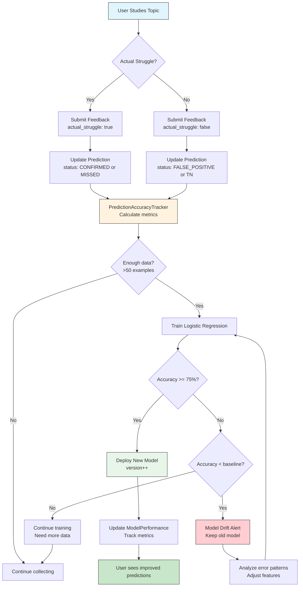

# Struggle Prediction API - Architecture Diagrams

## System Architecture

## API Endpoint Flow

## Feature Extraction Pipeline

## Intervention Application Flow

## Database Schema Relationships

## Prediction Model Decision Tree (Rule-Based)

## Error Handling Flow

## Deployment Architecture

## Model Training & Feedback Loop

---

## Legend

### Node Colors
- **Blue** - Next.js / Client Layer
- **Teal** - FastAPI / ML Service Layer
- **Dark Blue** - Database Layer
- **Red/Pink** - Errors / Alerts
- **Yellow** - Warnings / Medium Priority
- **Green** - Success / Low Risk
- **Orange** - Processing / Validation

### Relationship Types
- **Solid Line** - Synchronous API call
- **Dashed Line** - Asynchronous operation
- **Arrow** - Data flow direction

---

**Report Generated:** 2025-10-17
**Epic:** 5 - Behavioral Twin Engine
**Story:** 5.2 - Predictive Analytics for Learning Struggles
