# Pipeline Design: Key Decisions Summary

**Date:** 2025-10-27
**Author:** Backend Architect Agent
**Purpose:** Quick reference for data pipeline architectural decisions

---

## 1. Export Strategy: Full vs. Incremental

| Decision | Choice | Rationale |
|----------|--------|-----------|
| **Phase 1 (Day 1-7)** | ✅ **Full Export** (date range) | Simple, reliable, works for 100K-1M rows |
| **Phase 2 (Day 8+)** | 🔄 **Incremental CDC** | Only for 10M+ rows or hourly refresh needs |

**Implementation:**
```bash
# Phase 1: Full export (recommended)
python scripts/export_behavioral_events_v2.py --days 365

# Phase 2: Incremental (if needed)
# Use PostgreSQL logical replication or timestamp-based delta
```

---

## 2. Data Validation: When to Run Pandera

| Decision | Choice | Rationale |
|----------|--------|-----------|
| **Validation Timing** | ✅ **Pre-Export** (fail-fast) | Stop pipeline early, prevent invalid Parquet |
| **Validation Mode** | ✅ **Strict** (reject all on error) | Research-grade quality, no garbage-in-garbage-out |
| **Error Handling** | ✅ **Fail + Log Report** | Save error report CSV, notify via monitoring |

**Implementation:**
```python
# Validate BEFORE Parquet export
try:
    df_validated = validate_behavioral_events(df, strict=True, raise_on_error=True)
except pa.errors.SchemaError as e:
    e.failure_cases.to_csv("validation_errors.csv")
    sys.exit(1)  # Stop pipeline

df_validated.to_parquet(output_path)
```

---

## 3. DuckDB Sync: Direct Read vs. Table Load

| Strategy | Phase 1 (Day 1-7) | Phase 2 (Day 8+) |
|----------|-------------------|------------------|
| **A: Direct Parquet Read** | ✅ **Recommended** | Use if query < 500ms |
| **B: Table with Indexes** | ❌ Not needed yet | Switch if query > 500ms |

**When to Switch to Strategy B:**
- Query latency > 500ms (SLA breach)
- Dashboard queries >10 QPS (high frequency)
- Need UPDATE/DELETE operations

**Implementation:**

**Strategy A (Recommended):**
```sql
-- Zero-copy, always up-to-date
SELECT * FROM read_parquet('data/raw/behavioral_events_latest.parquet')
WHERE "experimentPhase" = 'intervention_A_1';

-- Create view for convenience
CREATE OR REPLACE VIEW behavioral_events AS
SELECT * FROM read_parquet('data/raw/behavioral_events_latest.parquet');
```

**Strategy B (If Needed):**
```sql
-- Load into table
CREATE TABLE behavioral_events AS SELECT * FROM read_parquet('...');

-- Add indexes
CREATE INDEX idx_user_timestamp ON behavioral_events (userId, timestamp);
CREATE INDEX idx_experiment_phase ON behavioral_events (experimentPhase);
```

---

## 4. Batch Size: Memory vs. Performance

| Decision | Choice | Rationale |
|----------|--------|-----------|
| **Batch Size** | ✅ **10,000 rows** | Balance memory (20-40 MB) + query time (0.5-2s) |
| **Pagination Strategy** | ✅ **OFFSET/LIMIT** | Simple, works for date-sorted data |
| **Progress Tracking** | ✅ **tqdm progress bar** | UX feedback for long exports |

**Implementation:**
```python
BATCH_SIZE = 10_000

with tqdm(total=total_rows, desc="Fetching rows") as pbar:
    while offset < total_rows:
        chunk_df = pd.read_sql(
            f"SELECT * FROM behavioral_events ORDER BY timestamp LIMIT {BATCH_SIZE} OFFSET {offset}",
            engine
        )
        all_chunks.append(chunk_df)
        pbar.update(len(chunk_df))
        offset += BATCH_SIZE
```

---

## 5. Parquet Compression: Snappy vs. Gzip

| Decision | Choice | Rationale |
|----------|--------|-----------|
| **Compression** | ✅ **Snappy** | 4x faster than gzip, 20% size savings |
| **Engine** | ✅ **pyarrow** | 2-3x faster than fastparquet |

**Performance Comparison:**

| Compression | Speed | Size (1M rows) | Query Speed |
|-------------|-------|----------------|-------------|
| **Snappy** | ⚡ 10-20s | 📦 50 MB | ⚡ 100-500ms |
| **Gzip** | 🐢 40-80s | 📦 40 MB | 🐢 200-800ms |
| **None** | ⚡⚡ 5-10s | 💾 200 MB | ⚡ 80-400ms |

**Recommendation:** Snappy (best balance)

---

## 6. Error Handling: Fail-Fast vs. Continue

| Error Type | Strategy | Rationale |
|------------|----------|-----------|
| **Pandera Validation** | ❌ **Fail-Fast** | Research quality, no bad data |
| **Database Transient Errors** | 🔄 **Retry 3x** | Network glitches, connection pool |
| **DuckDB Sync Errors** | ⚠️ **Warn + Continue** | Export succeeded, sync can retry later |

**Implementation:**
```python
# Validation: Fail-fast
try:
    df_validated = validate_behavioral_events(df, strict=True, raise_on_error=True)
except pa.errors.SchemaError:
    sys.exit(1)  # Stop pipeline

# Database: Retry
for attempt in range(3):
    try:
        df = pd.read_sql(query, engine)
        break
    except OperationalError:
        if attempt < 2:
            time.sleep(2 ** attempt)
        else:
            raise

# DuckDB: Warn + continue
try:
    sync_to_duckdb(parquet_path, duckdb_path)
except Exception as e:
    print(f"⚠️  DuckDB sync failed: {e}")
    print("   Export succeeded, sync can retry later")
```

---

## 7. DVC Versioning: When to Track

| Decision | Choice | Rationale |
|----------|--------|-----------|
| **Track Frequency** | ✅ **Daily** (nightly cron) | Balance freshness + Git history size |
| **File Naming** | ✅ **Timestamped** + Symlink | Immutable versions, "latest" pointer |
| **Remote Storage** | ✅ **S3/GCS/Azure** | Cloud backup, reproducibility |

**Implementation:**
```bash
# Daily export (nightly cron)
0 2 * * * python scripts/export_behavioral_events_v2.py --days 365

# DVC tracking
dvc add data/raw/behavioral_events_20251027_120000.parquet
git add data/raw/behavioral_events_20251027_120000.parquet.dvc
git commit -m "chore: Update behavioral events export"
dvc push
```

---

## 8. Deployment: Cron vs. Airflow vs. GitHub Actions

| Option | Phase 1 (Day 1-7) | Phase 2 (Day 8+) | Rationale |
|--------|-------------------|------------------|-----------|
| **Cron Job** | ✅ **Recommended** | ✅ Use if simple | Simple, works for single-server |
| **GitHub Actions** | ✅ **Recommended** | ❌ Limited runners | Good for small datasets (<10M rows) |
| **Airflow** | ❌ Overkill | ✅ Use if complex | Multi-step pipelines, monitoring, retries |

**Implementation:**

**Cron (Simplest):**
```bash
# crontab -e
0 2 * * * cd /path/to/americano/apps/ml-service && \
          python scripts/export_behavioral_events_v2.py --days 365 --validate --sync-duckdb
```

**GitHub Actions (Good Balance):**
```yaml
# .github/workflows/export-behavioral-data.yml
on:
  schedule:
    - cron: '0 2 * * *'  # Daily at 2 AM
jobs:
  export:
    runs-on: ubuntu-latest
    steps:
      - run: python scripts/export_behavioral_events_v2.py --days 365
```

**Airflow (Advanced):**
```python
# Only if you need multi-step orchestration, retries, monitoring
with DAG('export_behavioral_events', schedule_interval='@daily') as dag:
    export_task = BashOperator(task_id='export', bash_command='...')
    dvc_track = BashOperator(task_id='dvc_track', bash_command='...')
    export_task >> dvc_track
```

---

## 9. Monitoring: What to Track

| Metric | Alert Threshold | Action |
|--------|-----------------|--------|
| **Export Success Rate** | < 95% (7 days) | Investigate errors, check database |
| **Export Duration** | > 10 minutes | Optimize query, add indexes |
| **Validation Pass Rate** | < 100% | Fix schema drift, update Pandera |
| **Row Count Delta** | > 50% change | Verify data integrity, check for deletions |
| **Null Rate** | > 10% for required fields | Investigate data quality |

**Implementation:**
```python
# Log to monitoring system
mlflow.log_metric("export_success", 1 if success else 0)
mlflow.log_metric("export_rows", total_rows)
mlflow.log_metric("export_duration_seconds", duration)
mlflow.log_metric("validation_passed", 1 if validation_passed else 0)

# Alerts
if quality_metrics["unique_users"] < 5:
    send_slack_alert("⚠️  LOW USER COUNT")

if quality_metrics["null_counts"]["experimentPhase"] > total_rows * 0.9:
    send_slack_alert("⚠️  HIGH NULL RATE: experimentPhase")
```

---

## 10. Performance Targets

| Metric | Target | Measurement |
|--------|--------|-------------|
| **Export Time (100K rows)** | < 30 seconds | End-to-end (query → validate → Parquet) |
| **Export Time (1M rows)** | < 2 minutes | End-to-end |
| **DuckDB Query (ITS analysis)** | < 500ms | 95th percentile |
| **DuckDB Query (ABAB analysis)** | < 1 second | 95th percentile |
| **Parquet File Size (1M rows)** | 30-50 MB | Snappy compression |
| **Validation Time (1M rows)** | < 15 seconds | Pandera strict mode |

**Optimization Checklist:**
- ✅ PostgreSQL index: `(userId, timestamp)`
- ✅ Batch size: 10K rows
- ✅ Compression: Snappy
- ✅ Engine: pyarrow
- ✅ DuckDB: Direct Parquet read (Strategy A)

---

## Quick Decision Tree

```mermaid
graph TD
    A[Need to export data?] -->|Yes| B{Data size?}
    B -->|< 1M rows| C[Full export daily]
    B -->|> 10M rows| D[Incremental CDC]

    C --> E{Query performance?}
    D --> E

    E -->|< 500ms| F[DuckDB Strategy A:<br/>Direct Parquet read]
    E -->|> 500ms| G[DuckDB Strategy B:<br/>Table with indexes]

    F --> H{Deployment?}
    G --> H

    H -->|Simple| I[Cron job]
    H -->|Complex| J[Airflow DAG]
    H -->|Cloud| K[GitHub Actions]

    I --> L[✅ Production Ready]
    J --> L
    K --> L
```



---

## Next Steps Checklist

**Phase 1 (Day 1):**
- [ ] Update `export_behavioral_events.py` with Pandera validation
- [ ] Test with real data (100-10K rows)
- [ ] Document any validation errors

**Phase 2 (Day 2):**
- [ ] Add `--sync-duckdb` flag
- [ ] Create DuckDB view
- [ ] Verify row counts match

**Phase 3 (Day 3):**
- [ ] Set up nightly cron OR GitHub Actions
- [ ] Configure DVC remote (S3/GCS/Azure)
- [ ] Add monitoring metrics

**Phase 4 (Day 4+):**
- [ ] Run ITS analysis on real data
- [ ] Run ABAB analysis on real data
- [ ] Optimize if query > 500ms
