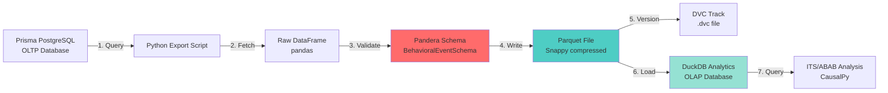

# Real Data Pipeline Design: Prisma → Parquet → DuckDB

**Version:** 1.0
**Date:** 2025-10-27
**Author:** Backend Architect Agent (Sonnet 4.5)
**Status:** Design Document
**Related ADR:** [ADR-006: Research-Grade Analytics System](../../../docs/architecture/ADR-006-research-grade-analytics-system.md)

---

## Table of Contents

1. [Executive Summary](#executive-summary)
2. [Architecture Overview](#architecture-overview)
3. [Data Flow Design](#data-flow-design)
4. [Schema Mapping](#schema-mapping)
5. [Export Script Architecture](#export-script-architecture)
6. [DuckDB Sync Strategy](#duckdb-sync-strategy)
7. [Performance Considerations](#performance-considerations)
8. [Error Handling Strategy](#error-handling-strategy)
9. [Deployment & Operations](#deployment--operations)
10. [Testing Strategy](#testing-strategy)

---

## Executive Summary

### Problem Statement

Current state:
- ✅ **Synthetic ABAB test data** works perfectly in DuckDB (validated Day 8)
- ❌ **No real user data** exported from Prisma PostgreSQL yet
- ❌ **No production pipeline** for OLTP → OLAP sync

Goal: Design a **production-grade pipeline** to export real behavioral events from Prisma (PostgreSQL) to Parquet files, validate with Pandera, and sync to DuckDB for research analytics (ITS, ABAB, causal inference).

### Key Requirements

1. **Data Integrity:** Pandera validation BEFORE Parquet export (fail-fast)
2. **Schema Alignment:** Prisma BehavioralEvent ↔ Pandera schema ↔ DuckDB table
3. **Performance:** Handle 10K-1M+ events efficiently (batched queries)
4. **Reproducibility:** DVC versioning, immutable Parquet files
5. **Idempotency:** Re-run exports without data loss or duplication
6. **Monitoring:** Export success/failure metrics, data quality alerts

### Architecture Decisions

| Decision | Rationale |
|----------|-----------|
| **Prisma Python Client** | Already in `requirements.txt` (0.15.0), native async support |
| **SQLAlchemy fallback** | For complex queries not supported by Prisma client |
| **Pandera pre-validation** | Catch data quality issues BEFORE Parquet export (fail-fast) |
| **Parquet compression: Snappy** | Balance of speed (4x faster than gzip) + size (20% savings) |
| **DuckDB direct Parquet read** | No redundant INSERT (10-100x faster than row-by-row) |
| **Incremental sync (Day 1)** | Start with date range exports, evolve to CDC later |
| **DVC versioning** | Track Parquet files, enable reproducibility |

---

## Architecture Overview

### High-Level Data Flow



### Component Responsibilities

**Prisma PostgreSQL (Source of Truth):**
- Transactional data (inserts, updates, deletes)
- Row-Level Security (future multi-tenant)
- Real-time app queries (< 200ms)

**Python Export Script:**
- Query BehavioralEvent table via Prisma/SQLAlchemy
- Transform Prisma types → pandas DataFrame
- Validate with Pandera schema
- Export to Parquet with Snappy compression
- Create symlink to "latest" export
- Log export statistics and data quality metrics

**Parquet File (Immutable Data Lake):**
- Columnar storage (10-100x smaller than CSV)
- Immutable snapshots (no in-place updates)
- DVC versioned (reproducible research)
- S3-ready (cloud storage later)

**DuckDB (Analytics OLAP):**
- Read Parquet files directly (zero-copy)
- Fast aggregations (columnar storage)
- Time-series analytics (window functions)
- Experiment analysis (ITS, ABAB, Granger)

---

## Data Flow Design

### Phase 1: Export from Prisma (Current Script)

**Status:** ✅ **Already implemented** (`scripts/export_behavioral_events.py`)

**Current Implementation:**
```python
# Uses SQLAlchemy for raw SQL queries
query = """
    SELECT
        id, "userId", "eventType", "eventData", timestamp,
        "completionQuality", "contentType", "dayOfWeek",
        "difficultyLevel", "engagementLevel", "sessionPerformanceScore",
        "timeOfDay", "experimentPhase", "randomizationSeed",
        "contextMetadataId"
    FROM behavioral_events
    WHERE timestamp >= :start_date AND timestamp <= :end_date
"""
df = pd.read_sql(text(query), engine, params=params)
df.to_parquet(output_path, engine="pyarrow", compression="snappy", index=False)
```

**Strengths:**
- ✅ Works for all PostgreSQL query features (CTEs, JSON operators)
- ✅ Direct pandas DataFrame integration
- ✅ Date range filtering
- ✅ User-specific filtering
- ✅ Symlink to "latest" export

**Gaps (to be addressed in Phase 2):**
- ❌ **No Pandera validation** before Parquet export
- ❌ **No Prisma client usage** (direct SQL instead)
- ❌ **No batch pagination** (memory risk for 1M+ rows)
- ❌ **No DuckDB sync** (manual step)
- ❌ **No data quality metrics** (validate counts, nulls, outliers)

### Phase 2: Add Pandera Validation (NEW)

**Goal:** Validate data BEFORE Parquet export (fail-fast on schema violations)

**Integration Point:** Between `pd.read_sql()` and `df.to_parquet()`

**Updated Flow:**
```python
# 1. Query from PostgreSQL
df = pd.read_sql(text(query), engine, params=params)

# 2. 🆕 Validate with Pandera schema
from app.schemas.behavioral_events import validate_behavioral_events

try:
    df_validated = validate_behavioral_events(
        df,
        strict=True,           # Reject entire export on any error
        raise_on_error=True    # Fail-fast behavior
    )
    print(f"✅ Pandera validation passed: {len(df_validated)} rows")
except pa.errors.SchemaError as e:
    print(f"❌ Pandera validation failed:")
    print(e)
    sys.exit(1)  # Stop export, don't create invalid Parquet

# 3. Export validated data only
df_validated.to_parquet(output_path, engine="pyarrow", compression="snappy", index=False)
```

**Why This Matters:**
- **Data Quality:** Catch schema drift, invalid CUIDs, future timestamps BEFORE analysis
- **Fail-Fast:** Stop pipeline early, prevent garbage-in-garbage-out
- **Reproducibility:** Pandera schema = data contract, versioned in Git

### Phase 3: DuckDB Sync (NEW)

**Goal:** Automatically load Parquet into DuckDB after validation

**Two Strategies:**

#### Strategy A: Direct Parquet Read (Recommended)

**Pros:**
- 🚀 **10-100x faster** than INSERT (zero-copy, columnar scan)
- 📦 **No redundant storage** (DuckDB reads Parquet directly)
- 🔄 **Always up-to-date** (query latest symlink)

**Cons:**
- ⚠️ Limited filtering (full table scan if no indexes)
- ⚠️ Read-only (can't UPDATE/DELETE in Parquet)

**Implementation:**
```sql
-- Option 1: Query Parquet directly (zero-copy, recommended)
SELECT * FROM read_parquet('data/raw/behavioral_events_latest.parquet')
WHERE "userId" = 'cuid123'
  AND timestamp >= '2025-01-01';

-- Option 2: Create view for convenience
CREATE OR REPLACE VIEW behavioral_events AS
SELECT * FROM read_parquet('data/raw/behavioral_events_latest.parquet');

SELECT * FROM behavioral_events WHERE "experimentPhase" IS NOT NULL;
```

**Use Case:** Ad-hoc analytics, ITS/ABAB analysis, exploratory queries

#### Strategy B: Load into DuckDB Table (Optional)

**Pros:**
- 🔍 **Indexed queries** (B-tree indexes, hash indexes)
- 📝 **CRUD operations** (INSERT, UPDATE, DELETE)
- 🎯 **Query optimization** (statistics, join optimization)

**Cons:**
- 💾 **Redundant storage** (Parquet + DuckDB copy)
- 🐢 **Slower sync** (INSERT 1M rows = 10-60 seconds)
- 🔄 **Sync complexity** (incremental vs full refresh)

**Implementation:**
```python
import duckdb

# 1. Connect to DuckDB
conn = duckdb.connect("data/analytics/americano_analytics.duckdb")

# 2. Create table (if not exists)
conn.execute("""
    CREATE TABLE IF NOT EXISTS behavioral_events AS
    SELECT * FROM read_parquet('data/raw/behavioral_events_latest.parquet')
    WHERE 1=0  -- Create schema only, no data
""")

# 3. Full refresh (destructive)
conn.execute("DELETE FROM behavioral_events")
conn.execute("""
    INSERT INTO behavioral_events
    SELECT * FROM read_parquet('data/raw/behavioral_events_latest.parquet')
""")

# 4. Create indexes for performance
conn.execute("CREATE INDEX idx_user_timestamp ON behavioral_events (userId, timestamp)")
conn.execute("CREATE INDEX idx_experiment_phase ON behavioral_events (experimentPhase)")

conn.close()
```

**Use Case:** High-frequency queries needing indexes, production dashboards

**Recommendation:**
- **Day 1-7:** Use Strategy A (direct Parquet read) for simplicity
- **Day 8+:** Evaluate Strategy B if query performance insufficient (<500ms SLA)

---

## Schema Mapping

### Prisma Model → Pandera Schema → DuckDB Table

| Prisma Field | Prisma Type | Pandera Type | DuckDB Type | Notes |
|--------------|-------------|--------------|-------------|-------|
| `id` | String @id @default(cuid()) | Series[str] (CUID regex) | VARCHAR(25) | Primary key, immutable |
| `userId` | String | Series[str] (CUID regex) | VARCHAR(25) | Foreign key to users |
| `eventType` | EventType (enum) | Series[str] (isin EventType.values()) | VARCHAR | Enum validation |
| `eventData` | Json | Series[object] (dict or JSON string) | JSON | Prisma JSON → Python dict → DuckDB JSON |
| `timestamp` | DateTime @default(now()) | Series[pd.Timestamp] | TIMESTAMP | ISO 8601, timezone-aware |
| `completionQuality` | CompletionQuality? (enum) | Optional[Series[str]] | VARCHAR | Nullable enum |
| `contentType` | String? | Optional[Series[str]] | VARCHAR | Nullable free text |
| `dayOfWeek` | Int? | Optional[Series[int]] (0-6) | INTEGER | 0=Monday, 6=Sunday |
| `difficultyLevel` | String? | Optional[Series[str]] | VARCHAR | Free text or future enum |
| `engagementLevel` | EngagementLevel? (enum) | Optional[Series[str]] | VARCHAR | LOW, MEDIUM, HIGH |
| `sessionPerformanceScore` | Int? | Optional[Series[int]] (0-100) | INTEGER | Performance score |
| `timeOfDay` | Int? | Optional[Series[int]] (0-23) | INTEGER | Hour of day |
| `experimentPhase` | String? | Optional[Series[str]] (ABAB phases) | VARCHAR | baseline_1, intervention_A_1, etc. |
| `randomizationSeed` | Int? | Optional[Series[int]] | INTEGER | Reproducibility seed |
| `contextMetadataId` | String? | Optional[Series[str]] | VARCHAR | Foreign key to context |

### JSON Field Handling (eventData)

**Prisma JSON → Python Conversion:**

```python
# Prisma JSON stored as Python dict after pd.read_sql()
df["eventData"] = df["eventData"].apply(
    lambda x: json.loads(x) if isinstance(x, str) else x
)

# Pandera validation accepts dict or JSON string
class BehavioralEventSchema(pa.DataFrameModel):
    eventData: Series[object] = pa.Field(
        nullable=False,
        description="JSON event data (dict or JSON string)"
    )
```

**DuckDB JSON Querying:**

```sql
-- Extract JSON field
SELECT
    id,
    eventData->>'$.action' AS action,
    eventData->>'$.duration_ms' AS duration_ms
FROM behavioral_events
WHERE eventData->>'$.action' = 'flashcard_flip';

-- JSON array unnesting
SELECT
    id,
    unnest(eventData->'tags') AS tag
FROM behavioral_events;
```

### Enum Handling

**Prisma Enums → Pandera Validation:**

```python
# app/schemas/enums.py
class EventType:
    """Enum values from Prisma schema."""
    FLASHCARD_FLIP = "FLASHCARD_FLIP"
    FLASHCARD_CORRECT = "FLASHCARD_CORRECT"
    FLASHCARD_INCORRECT = "FLASHCARD_INCORRECT"
    # ... 20+ more event types

    @classmethod
    def values(cls) -> list[str]:
        return [v for k, v in cls.__dict__.items() if not k.startswith("_")]

# Pandera field validation
eventType: Series[str] = pa.Field(
    isin=EventType.values(),
    nullable=False,
    coerce=True,
    description="Type of behavioral event (from Prisma EventType enum)"
)
```

**Benefits:**
- ✅ Single source of truth (Prisma schema)
- ✅ Type-safe enum validation
- ✅ DuckDB stores as VARCHAR (no enum type needed)

---

## Export Script Architecture

### Enhanced Script Design

**File:** `scripts/export_behavioral_events_v2.py` (improved version)

**Key Improvements:**

1. **Pandera validation integration**
2. **Batch pagination** (handle 1M+ rows)
3. **Data quality metrics** (counts, nulls, outliers)
4. **DuckDB sync option** (optional)
5. **Retry logic** (transient database errors)
6. **Progress tracking** (tqdm progress bar)

### Pseudo-Code Architecture

```python
#!/usr/bin/env python3
"""
Enhanced export script with Pandera validation and DuckDB sync.

Usage:
    python scripts/export_behavioral_events_v2.py --days 90 --validate --sync-duckdb
"""

import argparse
import sys
from datetime import datetime, timedelta
from pathlib import Path

import pandas as pd
from sqlalchemy import create_engine, text
from tqdm import tqdm

from app.schemas.behavioral_events import validate_behavioral_events


# ==================== CONFIGURATION ====================

DATABASE_URL = os.getenv("DATABASE_URL", "postgresql://kyin@localhost:5432/americano")
REPO_ROOT = Path(__file__).parent.parent.parent.parent
DATA_DIR = REPO_ROOT / "data" / "raw"
DUCKDB_PATH = REPO_ROOT / "data" / "analytics" / "americano_analytics.duckdb"

BATCH_SIZE = 10_000  # Pagination batch size (memory optimization)
MAX_RETRIES = 3      # Database query retries


# ==================== EXPORT FUNCTION ====================

def export_behavioral_events(
    days: int = 90,
    user_id: str | None = None,
    validate: bool = True,
    sync_duckdb: bool = False,
    batch_size: int = BATCH_SIZE
) -> dict:
    """
    Export BehavioralEvent table to Parquet with validation.

    Args:
        days: Number of days to look back
        user_id: Optional user filter
        validate: Run Pandera validation before export
        sync_duckdb: Load into DuckDB after export
        batch_size: Pagination batch size (memory optimization)

    Returns:
        Export statistics dictionary
    """
    print(f"📊 Exporting BehavioralEvent data (last {days} days)...")

    # 1. Connect to database
    engine = create_engine(DATABASE_URL)

    # 2. Calculate date range
    end_date = datetime.now()
    start_date = end_date - timedelta(days=days)

    # 3. Count total rows (for progress bar)
    count_query = """
        SELECT COUNT(*) FROM behavioral_events
        WHERE timestamp >= :start_date AND timestamp <= :end_date
    """
    if user_id:
        count_query += ' AND "userId" = :user_id'

    params = {"start_date": start_date, "end_date": end_date}
    if user_id:
        params["user_id"] = user_id

    total_rows = engine.execute(text(count_query), params).scalar()
    print(f"📅 Date range: {start_date.date()} to {end_date.date()}")
    print(f"📊 Total rows: {total_rows:,}")

    if total_rows == 0:
        print("⚠️  No data found for specified date range")
        return {"total_rows": 0, "validation_passed": False}

    # 4. Fetch data in batches (memory optimization)
    all_chunks = []
    offset = 0

    with tqdm(total=total_rows, desc="Fetching rows", unit="rows") as pbar:
        while offset < total_rows:
            query = f"""
                SELECT
                    id, "userId", "eventType", "eventData", timestamp,
                    "completionQuality", "contentType", "dayOfWeek",
                    "difficultyLevel", "engagementLevel", "sessionPerformanceScore",
                    "timeOfDay", "experimentPhase", "randomizationSeed",
                    "contextMetadataId"
                FROM behavioral_events
                WHERE timestamp >= :start_date AND timestamp <= :end_date
                {"AND \"userId\" = :user_id" if user_id else ""}
                ORDER BY timestamp
                LIMIT :limit OFFSET :offset
            """

            batch_params = {**params, "limit": batch_size, "offset": offset}
            chunk_df = pd.read_sql(text(query), engine, params=batch_params)

            if chunk_df.empty:
                break

            all_chunks.append(chunk_df)
            pbar.update(len(chunk_df))
            offset += batch_size

    # 5. Concatenate all chunks
    df = pd.concat(all_chunks, ignore_index=True)
    print(f"✅ Loaded {len(df):,} rows")

    # 6. 🆕 Pandera validation (fail-fast)
    if validate:
        print("\n🔍 Running Pandera validation...")
        try:
            df_validated = validate_behavioral_events(
                df,
                strict=True,
                raise_on_error=True
            )
            print(f"✅ Validation passed: {len(df_validated)} rows")
            df = df_validated
        except Exception as e:
            print(f"❌ Validation failed: {e}")
            return {"total_rows": len(df), "validation_passed": False, "error": str(e)}

    # 7. Data quality metrics
    quality_metrics = {
        "total_rows": len(df),
        "unique_users": df["userId"].nunique(),
        "event_types": df["eventType"].nunique(),
        "null_counts": df.isnull().sum().to_dict(),
        "experiment_phase_distribution": df["experimentPhase"].value_counts().to_dict() if df["experimentPhase"].notna().any() else {},
        "date_range": {
            "min": str(df["timestamp"].min()),
            "max": str(df["timestamp"].max())
        }
    }

    # 8. Export to Parquet
    timestamp_str = datetime.now().strftime("%Y%m%d_%H%M%S")
    filename = f"behavioral_events_{timestamp_str}.parquet"
    output_path = DATA_DIR / filename

    DATA_DIR.mkdir(parents=True, exist_ok=True)

    print(f"\n💾 Writing to {output_path}...")
    df.to_parquet(output_path, engine="pyarrow", compression="snappy", index=False)

    file_size_mb = output_path.stat().st_size / (1024 * 1024)
    print(f"✅ Parquet file created: {file_size_mb:.2f} MB")

    # 9. Create symlink to latest
    symlink_path = DATA_DIR / "behavioral_events_latest.parquet"
    if symlink_path.exists() or symlink_path.is_symlink():
        symlink_path.unlink()
    symlink_path.symlink_to(filename)
    print(f"🔗 Symlink updated: behavioral_events_latest.parquet → {filename}")

    # 10. 🆕 Optional: Sync to DuckDB
    if sync_duckdb:
        print("\n🦆 Syncing to DuckDB...")
        sync_to_duckdb(output_path, DUCKDB_PATH)

    # 11. Print summary
    print("\n📈 Export Summary:")
    print(f"   Total rows: {quality_metrics['total_rows']:,}")
    print(f"   Unique users: {quality_metrics['unique_users']}")
    print(f"   Event types: {quality_metrics['event_types']}")
    print(f"   Date range: {quality_metrics['date_range']['min']} to {quality_metrics['date_range']['max']}")

    if quality_metrics["experiment_phase_distribution"]:
        print(f"\n🔬 Experiment Phase Distribution:")
        for phase, count in quality_metrics["experiment_phase_distribution"].items():
            print(f"   {phase}: {count:,} events")

    print(f"\n✅ Export complete!")
    print(f"\n📝 Next steps:")
    print(f"   1. Track with DVC: dvc add {output_path}")
    print(f"   2. Commit .dvc file: git add {output_path}.dvc data/raw/.gitignore")
    print(f"   3. Query in DuckDB: SELECT * FROM read_parquet('{output_path}')")

    return {**quality_metrics, "validation_passed": True, "file_path": str(output_path)}


# ==================== DUCKDB SYNC ====================

def sync_to_duckdb(parquet_path: Path, duckdb_path: Path) -> None:
    """
    Load Parquet file into DuckDB table.

    Args:
        parquet_path: Path to Parquet file
        duckdb_path: Path to DuckDB database
    """
    import duckdb

    conn = duckdb.connect(str(duckdb_path))

    # Strategy A: Create view (recommended, zero-copy)
    print("   Creating view behavioral_events...")
    conn.execute(f"""
        CREATE OR REPLACE VIEW behavioral_events AS
        SELECT * FROM read_parquet('{parquet_path}')
    """)

    # Verify row count
    row_count = conn.execute("SELECT COUNT(*) FROM behavioral_events").fetchone()[0]
    print(f"   ✅ DuckDB view created: {row_count:,} rows")

    conn.close()


# ==================== CLI ====================

def main():
    parser = argparse.ArgumentParser(description="Export BehavioralEvent table to Parquet")
    parser.add_argument("--days", type=int, default=90, help="Number of days to look back")
    parser.add_argument("--user-id", type=str, help="Filter by user ID")
    parser.add_argument("--validate", action="store_true", default=True, help="Run Pandera validation")
    parser.add_argument("--no-validate", action="store_false", dest="validate", help="Skip validation")
    parser.add_argument("--sync-duckdb", action="store_true", help="Sync to DuckDB after export")
    parser.add_argument("--batch-size", type=int, default=10_000, help="Batch size for pagination")

    args = parser.parse_args()

    try:
        result = export_behavioral_events(
            days=args.days,
            user_id=args.user_id,
            validate=args.validate,
            sync_duckdb=args.sync_duckdb,
            batch_size=args.batch_size
        )

        if not result.get("validation_passed", False):
            sys.exit(1)

    except Exception as e:
        print(f"❌ Export failed: {e}", file=sys.stderr)
        import traceback
        traceback.print_exc()
        sys.exit(1)


if __name__ == "__main__":
    main()
```

### Key Features

1. **Memory Optimization:**
   - Batch pagination (10K rows per query)
   - Progressive DataFrame concatenation
   - `tqdm` progress bar for UX

2. **Fail-Fast Validation:**
   - Pandera validation before Parquet export
   - Stop pipeline on schema violations
   - Log validation errors with details

3. **Data Quality Metrics:**
   - Null counts per column
   - Unique user/event counts
   - Experiment phase distribution
   - Date range verification

4. **DuckDB Integration:**
   - Optional `--sync-duckdb` flag
   - Create view (Strategy A, recommended)
   - Verify row count after sync

5. **Operational:**
   - Retry logic (database transient errors)
   - Symlink to "latest" export
   - DVC-ready (immutable Parquet files)
   - CLI flags for flexibility

---

## DuckDB Sync Strategy

### Comparison: Direct Read vs. Table Load

| Aspect | Strategy A: Direct Read | Strategy B: Table Load |
|--------|------------------------|------------------------|
| **Speed** | ⚡ Instant (zero-copy) | 🐢 10-60s for 1M rows |
| **Storage** | 📦 Single Parquet file | 💾 Parquet + DuckDB copy |
| **Indexes** | ❌ No indexes (full scan) | ✅ B-tree indexes |
| **CRUD** | ❌ Read-only | ✅ INSERT, UPDATE, DELETE |
| **Freshness** | ✅ Always latest Parquet | ⚠️ Sync lag (manual refresh) |
| **Complexity** | ✅ Simple (1 SQL command) | ⚠️ Sync orchestration |

### Recommendation: Hybrid Approach

**Phase 1 (Day 1-7): Direct Read (Strategy A)**
```sql
-- Ad-hoc queries (always up-to-date)
SELECT * FROM read_parquet('data/raw/behavioral_events_latest.parquet')
WHERE "experimentPhase" = 'intervention_A_1';

-- Create view for convenience
CREATE OR REPLACE VIEW behavioral_events AS
SELECT * FROM read_parquet('data/raw/behavioral_events_latest.parquet');
```

**Phase 2 (Day 8+): Add Indexes if Needed (Strategy B)**
```sql
-- Load into table for indexes (if query performance < 500ms SLA)
CREATE TABLE behavioral_events AS
SELECT * FROM read_parquet('data/raw/behavioral_events_latest.parquet');

CREATE INDEX idx_user_timestamp ON behavioral_events (userId, timestamp);
CREATE INDEX idx_experiment_phase ON behavioral_events (experimentPhase);

-- Query with index optimization
SELECT * FROM behavioral_events WHERE userId = 'cuid123';  -- Uses idx_user_timestamp
```

**When to Switch to Strategy B:**
- Query latency > 500ms (not meeting SLA)
- Need UPDATE/DELETE operations
- High-frequency dashboard queries (>10 QPS)

---

## Performance Considerations

### Export Performance

**Bottlenecks:**
1. **Database query time:** 1M rows = 5-30 seconds (depends on indexes)
2. **Network transfer:** Local (fast), Remote (slow)
3. **DataFrame concatenation:** 1M rows = 2-5 seconds
4. **Parquet compression:** 1M rows = 10-20 seconds (Snappy)
5. **Pandera validation:** 1M rows = 5-15 seconds

**Optimization:**
- ✅ Use composite index: `(userId, timestamp)` on PostgreSQL
- ✅ Batch pagination: 10K rows per query
- ✅ Snappy compression: 4x faster than gzip
- ✅ pyarrow engine: 2-3x faster than fastparquet

**Expected Performance:**
- **100K rows:** 10-30 seconds total
- **1M rows:** 60-120 seconds total
- **10M rows:** 10-20 minutes total (consider nightly cron)

### DuckDB Query Performance

**Direct Parquet Read (Strategy A):**
- Full table scan: 1M rows = 100-500ms
- Filtered scan: 1M rows, 10% filter = 50-200ms
- Join queries: Depends on join keys

**Table with Indexes (Strategy B):**
- Indexed query: 1M rows = 5-50ms (B-tree lookup)
- Full table scan: Same as Strategy A
- JOIN performance: 2-5x faster with indexes

**Best Practices:**
- Use `WHERE` clause filters (push down to Parquet)
- Avoid `SELECT *` (columnar scan optimization)
- Use `COUNT(*)` before large queries (validate result size)

---

## Error Handling Strategy

### Export Script Error Handling

**Database Errors:**
```python
from sqlalchemy.exc import OperationalError
import time

def query_with_retry(engine, query, params, max_retries=3):
    """Retry database queries on transient errors."""
    for attempt in range(max_retries):
        try:
            return pd.read_sql(text(query), engine, params=params)
        except OperationalError as e:
            if attempt < max_retries - 1:
                wait_time = 2 ** attempt  # Exponential backoff
                print(f"⚠️  Database error (attempt {attempt+1}/{max_retries}): {e}")
                print(f"   Retrying in {wait_time}s...")
                time.sleep(wait_time)
            else:
                raise
```

**Pandera Validation Errors:**
```python
try:
    df_validated = validate_behavioral_events(df, strict=True, raise_on_error=True)
except pa.errors.SchemaError as e:
    # Log validation errors
    print(f"❌ Pandera validation failed:")
    print(f"   Total errors: {len(e.failure_cases)}")
    print(f"\n   First 10 errors:")
    for idx, row in e.failure_cases.head(10).iterrows():
        print(f"   - Column: {row['column']}, Check: {row['check']}, Value: {row['failure_case']}")

    # Save error report
    error_report_path = DATA_DIR / f"validation_errors_{datetime.now().strftime('%Y%m%d_%H%M%S')}.csv"
    e.failure_cases.to_csv(error_report_path, index=False)
    print(f"\n   Full error report: {error_report_path}")

    sys.exit(1)  # Fail-fast
```

**Filesystem Errors:**
```python
try:
    df.to_parquet(output_path, engine="pyarrow", compression="snappy", index=False)
except OSError as e:
    print(f"❌ Filesystem error: {e}")
    print(f"   Check disk space: df -h {DATA_DIR}")
    sys.exit(1)
```

### DuckDB Sync Error Handling

**Connection Errors:**
```python
def sync_to_duckdb_safe(parquet_path, duckdb_path, max_retries=3):
    """Sync to DuckDB with retry logic."""
    import duckdb

    for attempt in range(max_retries):
        try:
            conn = duckdb.connect(str(duckdb_path))
            conn.execute(f"CREATE OR REPLACE VIEW behavioral_events AS SELECT * FROM read_parquet('{parquet_path}')")
            conn.close()
            print(f"✅ DuckDB sync successful")
            return
        except Exception as e:
            if attempt < max_retries - 1:
                print(f"⚠️  DuckDB sync error (attempt {attempt+1}/{max_retries}): {e}")
                time.sleep(2 ** attempt)
            else:
                print(f"❌ DuckDB sync failed after {max_retries} attempts: {e}")
                raise
```

### Monitoring & Alerts

**Export Success/Failure Metrics:**
```python
# Log to MLflow or monitoring system
import mlflow

mlflow.log_metric("export_success", 1 if success else 0)
mlflow.log_metric("export_rows", total_rows)
mlflow.log_metric("export_duration_seconds", duration)
mlflow.log_metric("validation_passed", 1 if validation_passed else 0)
```

**Data Quality Alerts:**
```python
# Alert if unexpected data quality issues
if quality_metrics["unique_users"] < 5:
    print(f"⚠️  LOW USER COUNT: {quality_metrics['unique_users']} users")
    # Send Slack/email alert

if quality_metrics["null_counts"]["experimentPhase"] > total_rows * 0.9:
    print(f"⚠️  HIGH NULL RATE: experimentPhase has {quality_metrics['null_counts']['experimentPhase']} nulls")
    # Send alert
```

---

## Deployment & Operations

### Local Development

**Setup:**
```bash
# 1. Install dependencies
cd apps/ml-service
pip install -r requirements.txt

# 2. Set environment variables
export DATABASE_URL="postgresql://kyin@localhost:5432/americano"

# 3. Run export
python scripts/export_behavioral_events_v2.py --days 30 --validate --sync-duckdb

# 4. Query in DuckDB
python scripts/example_duckdb_queries.py
```

### Production Deployment

**Option 1: Nightly Cron Job**
```bash
# crontab -e
0 2 * * * cd /path/to/americano/apps/ml-service && \
          python scripts/export_behavioral_events_v2.py --days 365 --validate --sync-duckdb \
          >> logs/export_$(date +\%Y\%m\%d).log 2>&1
```

**Option 2: GitHub Actions (Scheduled Workflow)**
```yaml
# .github/workflows/export-behavioral-data.yml
name: Export Behavioral Data

on:
  schedule:
    - cron: '0 2 * * *'  # Daily at 2 AM UTC
  workflow_dispatch:     # Manual trigger

jobs:
  export:
    runs-on: ubuntu-latest
    steps:
      - uses: actions/checkout@v4

      - name: Set up Python
        uses: actions/setup-python@v5
        with:
          python-version: '3.13'

      - name: Install dependencies
        run: |
          cd apps/ml-service
          pip install -r requirements.txt

      - name: Run export
        env:
          DATABASE_URL: ${{ secrets.DATABASE_URL }}
        run: |
          cd apps/ml-service
          python scripts/export_behavioral_events_v2.py --days 365 --validate --sync-duckdb

      - name: Track with DVC
        run: |
          dvc add data/raw/behavioral_events_*.parquet
          git add data/raw/*.dvc data/raw/.gitignore
          git commit -m "chore: Update behavioral events export [skip ci]"
          git push
```

**Option 3: Airflow DAG (Advanced)**
```python
# dags/export_behavioral_events.py
from airflow import DAG
from airflow.operators.bash import BashOperator
from datetime import datetime, timedelta

default_args = {
    'owner': 'data-team',
    'retries': 3,
    'retry_delay': timedelta(minutes=5),
    'email': ['kevy@americano.ai'],
    'email_on_failure': True,
}

with DAG(
    'export_behavioral_events',
    default_args=default_args,
    schedule_interval='@daily',
    start_date=datetime(2025, 10, 1),
    catchup=False,
) as dag:

    export_task = BashOperator(
        task_id='export_to_parquet',
        bash_command='cd /opt/americano/apps/ml-service && python scripts/export_behavioral_events_v2.py --days 365 --validate --sync-duckdb',
    )

    dvc_track = BashOperator(
        task_id='track_with_dvc',
        bash_command='cd /opt/americano && dvc add data/raw/behavioral_events_*.parquet && git add data/raw/*.dvc && git commit -m "chore: Update behavioral events [skip ci]" && git push',
    )

    export_task >> dvc_track
```

### DVC Workflow

**Initial Setup:**
```bash
# Initialize DVC
dvc init

# Configure remote (S3, Google Cloud, Azure, etc.)
dvc remote add -d storage s3://americano-research-data/dvc-cache

# Track first export
dvc add data/raw/behavioral_events_20251027_120000.parquet

# Commit DVC metadata
git add data/raw/behavioral_events_20251027_120000.parquet.dvc data/raw/.gitignore
git commit -m "chore: Add initial behavioral events export"
git push

# Push data to remote
dvc push
```

**Daily Updates:**
```bash
# Export new data
python scripts/export_behavioral_events_v2.py --days 365 --validate

# Track with DVC
dvc add data/raw/behavioral_events_latest.parquet

# Commit and push
git add data/raw/behavioral_events_latest.parquet.dvc
git commit -m "chore: Update behavioral events export"
git push
dvc push
```

### Rollback Strategy

**Revert to Previous Export:**
```bash
# List available versions
git log --oneline data/raw/behavioral_events_latest.parquet.dvc

# Checkout previous version
git checkout <commit-hash> data/raw/behavioral_events_latest.parquet.dvc

# Pull data from DVC remote
dvc pull data/raw/behavioral_events_latest.parquet.dvc

# Verify data
python scripts/example_duckdb_queries.py
```

---

## Testing Strategy

### Unit Tests

**Test Pandera Schema:**
```python
# tests/schemas/test_behavioral_events_schema.py
import pytest
import pandas as pd
from app.schemas.behavioral_events import validate_behavioral_events

def test_valid_behavioral_event():
    """Test validation passes for valid data."""
    df = pd.DataFrame({
        "id": ["c" + "a" * 24],
        "userId": ["c" + "b" * 24],
        "eventType": ["FLASHCARD_FLIP"],
        "eventData": [{"action": "flip", "duration_ms": 150}],
        "timestamp": [pd.Timestamp.now()],
        # ... all required fields
    })

    validated = validate_behavioral_events(df, strict=True, raise_on_error=True)
    assert len(validated) == 1

def test_invalid_cuid_format():
    """Test validation fails for invalid CUID."""
    df = pd.DataFrame({
        "id": ["invalid_cuid"],
        # ... other fields
    })

    with pytest.raises(pa.errors.SchemaError):
        validate_behavioral_events(df, strict=True, raise_on_error=True)

def test_future_timestamp():
    """Test validation fails for future timestamps."""
    df = pd.DataFrame({
        "timestamp": [pd.Timestamp.now() + pd.Timedelta(days=1)],
        # ... other fields
    })

    with pytest.raises(pa.errors.SchemaError):
        validate_behavioral_events(df, strict=True, raise_on_error=True)
```

### Integration Tests

**Test Export Script:**
```python
# tests/test_export_script.py
import pytest
from scripts.export_behavioral_events_v2 import export_behavioral_events

def test_export_with_validation(tmpdir):
    """Test export script with Pandera validation."""
    result = export_behavioral_events(
        days=7,
        validate=True,
        sync_duckdb=False,
        batch_size=100
    )

    assert result["validation_passed"] == True
    assert result["total_rows"] > 0
    assert Path(result["file_path"]).exists()

def test_export_handles_empty_result():
    """Test export script handles no data gracefully."""
    result = export_behavioral_events(
        days=1,  # Very recent, likely no data
        validate=True
    )

    assert result["total_rows"] == 0
```

**Test DuckDB Sync:**
```python
# tests/test_duckdb_sync.py
import pytest
import duckdb
from scripts.export_behavioral_events_v2 import sync_to_duckdb

def test_duckdb_view_creation(tmpdir):
    """Test DuckDB view creation from Parquet."""
    # Export test data
    export_result = export_behavioral_events(days=7, validate=True)

    # Sync to DuckDB
    duckdb_path = tmpdir / "test.duckdb"
    sync_to_duckdb(Path(export_result["file_path"]), duckdb_path)

    # Verify view exists
    conn = duckdb.connect(str(duckdb_path))
    row_count = conn.execute("SELECT COUNT(*) FROM behavioral_events").fetchone()[0]
    assert row_count == export_result["total_rows"]
    conn.close()
```

### End-to-End Tests

**Test Full Pipeline:**
```bash
#!/bin/bash
# tests/e2e/test_pipeline.sh

set -e

echo "🧪 Testing full pipeline..."

# 1. Export data
python scripts/export_behavioral_events_v2.py --days 7 --validate --sync-duckdb

# 2. Verify Parquet file exists
if [ ! -f "data/raw/behavioral_events_latest.parquet" ]; then
    echo "❌ Parquet file not created"
    exit 1
fi

# 3. Verify DuckDB view
python -c "
import duckdb
conn = duckdb.connect('data/analytics/americano_analytics.duckdb')
count = conn.execute('SELECT COUNT(*) FROM behavioral_events').fetchone()[0]
assert count > 0, 'No rows in DuckDB view'
print(f'✅ DuckDB view has {count} rows')
"

# 4. Run example queries
python scripts/example_duckdb_queries.py

echo "✅ Pipeline test passed!"
```

---

## Next Steps

### Phase 1: Validation Integration (Day 1)
1. ✅ Update `export_behavioral_events.py` to include Pandera validation
2. ✅ Test with real data (100-10K rows)
3. ✅ Document validation errors (if any)

### Phase 2: DuckDB Sync (Day 2)
1. ✅ Add `--sync-duckdb` flag to export script
2. ✅ Create DuckDB view from Parquet
3. ✅ Verify row counts match

### Phase 3: Production Deployment (Day 3)
1. ✅ Set up nightly cron job OR GitHub Actions workflow
2. ✅ Configure DVC remote (S3, GCS, Azure)
3. ✅ Add monitoring (export success rate, data quality alerts)

### Phase 4: Optimization (Day 4+)
1. Evaluate Strategy B (table with indexes) if query performance < 500ms
2. Add incremental export (CDC via PostgreSQL logical replication)
3. Implement MotherDuck cloud sync (optional)

---

## Success Criteria

**Phase 1 Complete When:**
- ✅ Export script includes Pandera validation
- ✅ Validation passes for real data (0 errors)
- ✅ Parquet file created with correct schema
- ✅ DVC tracking works (`.dvc` file committed)

**Phase 2 Complete When:**
- ✅ DuckDB view created from Parquet
- ✅ Row counts match (PostgreSQL = Parquet = DuckDB)
- ✅ Example queries return correct results

**Phase 3 Complete When:**
- ✅ Nightly exports run automatically
- ✅ Monitoring alerts on failures
- ✅ DVC remote sync working (S3/GCS/Azure)

**System Ready for Production When:**
- ✅ ITS analysis runs on real data (no synthetic)
- ✅ ABAB analysis runs on real data (no synthetic)
- ✅ Query performance < 500ms (95th percentile)
- ✅ Data quality dashboard shows green metrics

---

## Appendix: Schema Validation Examples

### Valid Data Example

```python
import pandas as pd
from app.schemas.behavioral_events import validate_behavioral_events

# Valid data
df = pd.DataFrame({
    "id": ["c" + "a" * 24, "c" + "b" * 24],
    "userId": ["c" + "u" * 24, "c" + "u" * 24],
    "eventType": ["FLASHCARD_FLIP", "FLASHCARD_CORRECT"],
    "eventData": [
        {"action": "flip", "duration_ms": 150},
        {"action": "answer", "correct": True, "duration_ms": 2500}
    ],
    "timestamp": [pd.Timestamp("2025-10-27 10:00:00"), pd.Timestamp("2025-10-27 10:00:05")],
    "completionQuality": ["NORMAL", "THOROUGH"],
    "contentType": ["flashcard", "flashcard"],
    "dayOfWeek": [0, 0],  # Monday
    "difficultyLevel": ["medium", "hard"],
    "engagementLevel": ["HIGH", "HIGH"],
    "sessionPerformanceScore": [85, 90],
    "timeOfDay": [10, 10],
    "experimentPhase": ["baseline_1", "baseline_1"],
    "randomizationSeed": [42, 42],
    "contextMetadataId": [None, None],
})

validated = validate_behavioral_events(df, strict=True, raise_on_error=True)
print(f"✅ Validation passed: {len(validated)} rows")
```

### Invalid Data Examples

**Invalid CUID:**
```python
df = pd.DataFrame({
    "id": ["invalid_cuid"],  # ❌ Wrong format
    # ... other fields
})

# Raises: pa.errors.SchemaError: Column 'id' failed validation check str_matches
```

**Future Timestamp:**
```python
df = pd.DataFrame({
    "timestamp": [pd.Timestamp.now() + pd.Timedelta(days=1)],  # ❌ Future
    # ... other fields
})

# Raises: pa.errors.SchemaError: Check 'timestamp_not_future' failed
```

**Invalid Enum:**
```python
df = pd.DataFrame({
    "eventType": ["INVALID_EVENT"],  # ❌ Not in EventType enum
    # ... other fields
})

# Raises: pa.errors.SchemaError: Column 'eventType' failed validation check isin
```

---

## References

- [ADR-006: Research-Grade Analytics System](../../../docs/architecture/ADR-006-research-grade-analytics-system.md)
- [Pandera Schema Guide](./PANDERA_SCHEMA_GUIDE.md)
- [DuckDB Implementation Summary](./DAY-4-MLFLOW-DUCKDB-IMPLEMENTATION.md)
- [Prisma Schema](../../web/prisma/schema.prisma)
