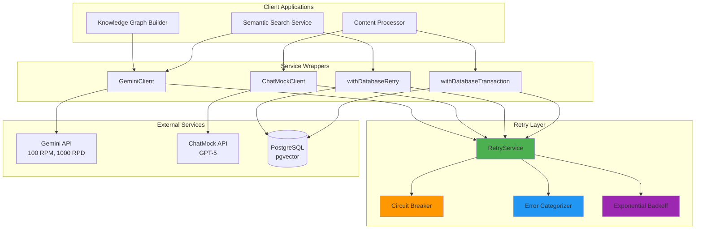
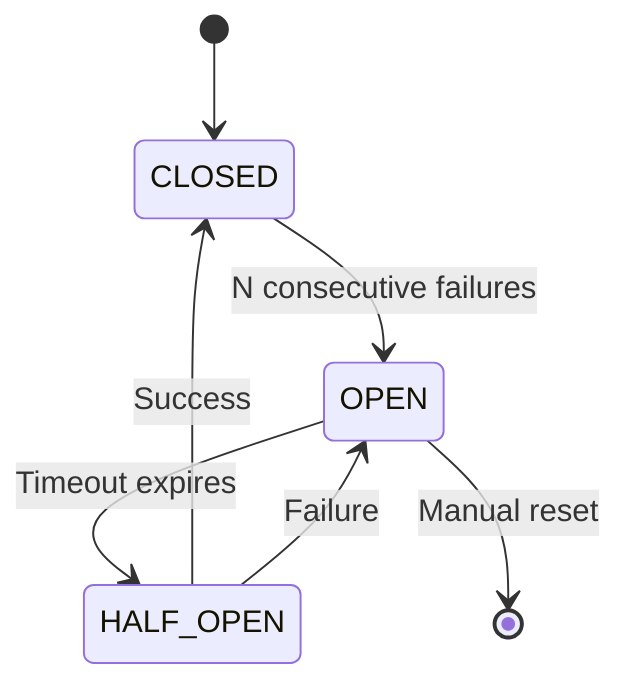
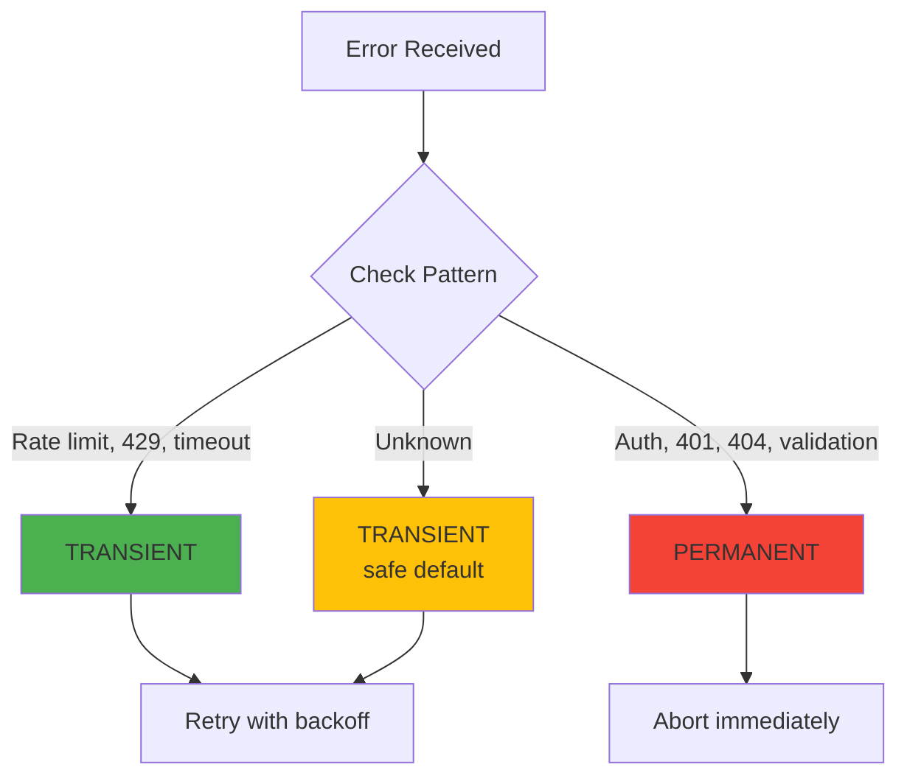
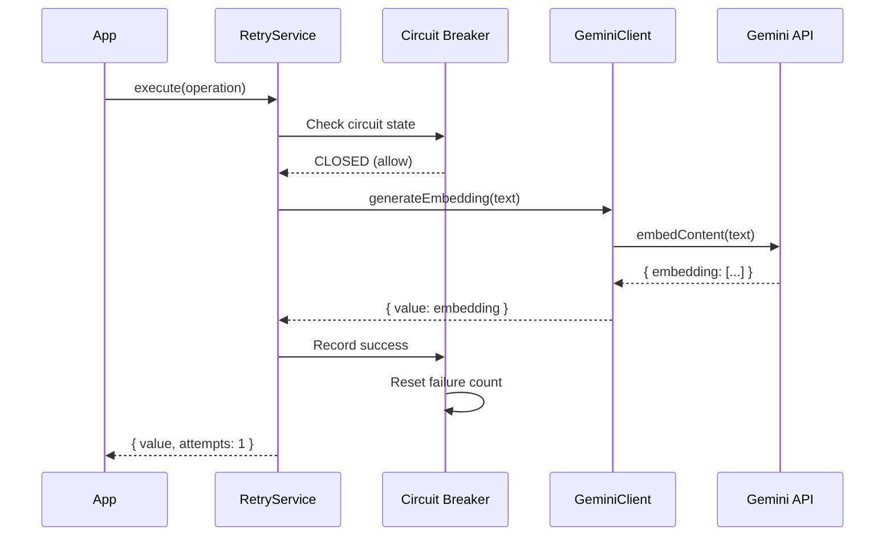
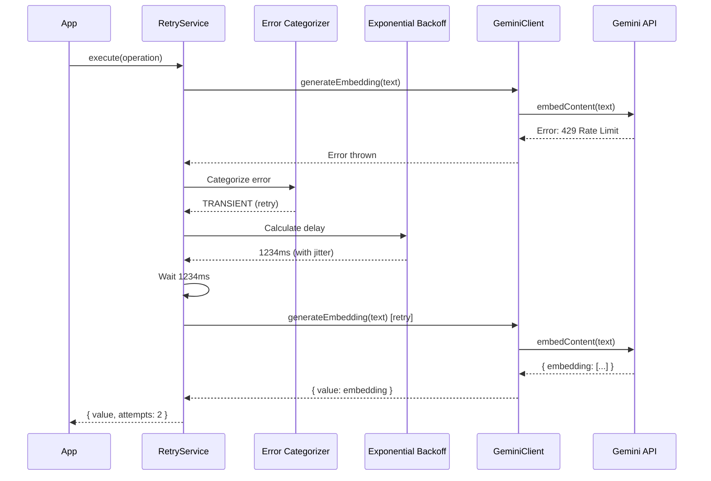
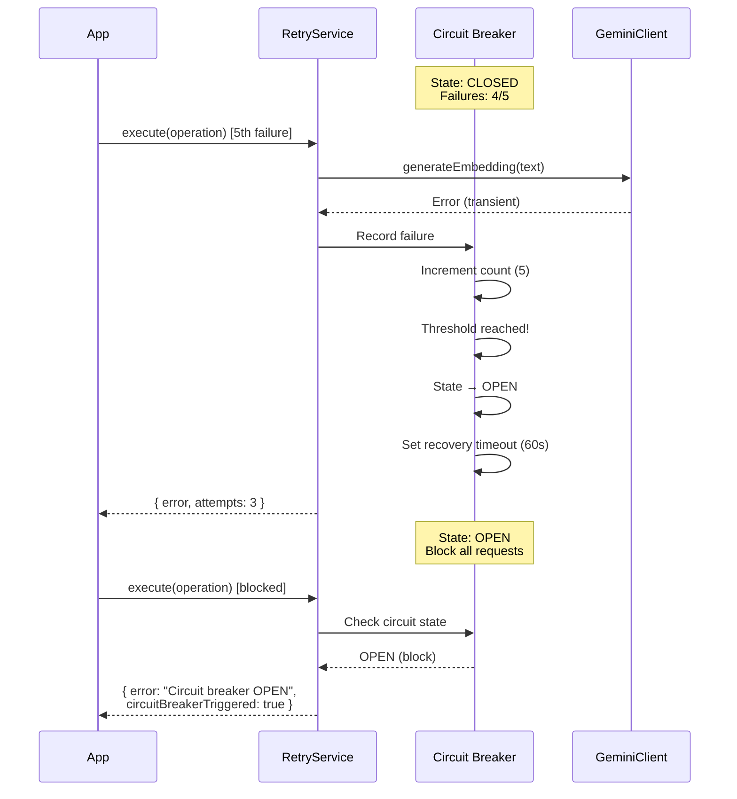

# Retry Strategy Architecture - Epic 3

## Overview

Production-ready retry mechanism with exponential backoff, circuit breaker, and error categorization for Gemini API, ChatMock API, and database operations.

## Architecture Diagram



## Component Details

### 1. RetryService (Core)

**Responsibilities:**
- Execute operations with retry logic
- Manage circuit breaker state
- Apply exponential backoff
- Categorize errors
- Track retry metadata

**Key Methods:**
```typescript
retryService.execute<T>(
  operation: () => Promise<T>,
  policy: RetryPolicy,
  operationName: string
): Promise<RetryResult<T>>
```

### 2. Circuit Breaker

**State Machine:**



**Thresholds:**
- Gemini API: 5 failures → OPEN (60s timeout)
- ChatMock API: 3 failures → OPEN (120s timeout)
- Database: 10 failures → OPEN (30s timeout)

### 3. Error Categorizer

**Decision Tree:**



**Transient Errors (Retry):**
- Rate limits: `429`, `"rate limit"`, `"too many requests"`
- Timeouts: `ETIMEDOUT`, `ECONNRESET`, `"timeout"`
- Service errors: `503`, `502`, `504`
- Database: `"deadlock"`, `"lock timeout"`, `"connection"`

**Permanent Errors (Abort):**
- Auth: `401`, `403`, `"unauthorized"`, `"invalid api key"`
- Client: `400`, `404`, `"validation error"`
- Database: `"unique constraint"`, `"foreign key constraint"`

### 4. Exponential Backoff

**Formula:**
```
delay = min(initialDelay * (multiplier ^ attempt), maxDelay) + jitter
jitter = random(-30%, +30%) * delay
```

**Example (Gemini API):**
```
Attempt 1: 1000ms + jitter (700-1300ms)
Attempt 2: 2000ms + jitter (1400-2600ms)
Attempt 3: 4000ms + jitter (2800-5200ms)
```

**Benefits:**
- Prevents thundering herd (jitter)
- Backs off aggressively (exponential)
- Caps max delay (prevents infinite waits)

## Data Flow

### Success Path



### Retry Path



### Circuit Breaker Trip Path



## Integration Patterns

### Pattern 1: Direct API Integration (GeminiClient)

```typescript
// apps/web/src/lib/ai/gemini-client.ts
export class GeminiClient {
  async generateEmbedding(text: string) {
    return retryService.execute(
      async () => {
        const model = this.genAI.getGenerativeModel({ model: 'gemini-embedding-001' })
        const result = await model.embedContent(text)
        return result.embedding.values
      },
      DEFAULT_POLICIES.GEMINI_API,
      'gemini-embedding'
    )
  }
}
```

### Pattern 2: Wrapper Integration (Database)

```typescript
// apps/web/src/lib/retry/database-retry.ts
export async function withDatabaseRetry<T>(
  operation: () => Promise<T>,
  operationName: string
) {
  return retryService.execute(
    operation,
    DATABASE_RETRY_POLICY,
    `db:${operationName}`
  )
}

// Usage
const user = await withDatabaseRetry(
  async () => prisma.user.findUnique({ where: { id } }),
  'findUnique-user'
)
```

### Pattern 3: Transaction Integration

```typescript
// Transaction wrapper
export async function withDatabaseTransaction<T>(
  prisma: PrismaClient,
  transactionFn: (tx) => Promise<T>,
  operationName: string
) {
  return withDatabaseRetry(
    async () => prisma.$transaction(transactionFn),
    `transaction:${operationName}`
  )
}

// Usage
await withDatabaseTransaction(
  prisma,
  async (tx) => {
    const lecture = await tx.lecture.create({ data })
    const chunks = await tx.contentChunk.createMany({ data })
    return { lecture, chunks }
  },
  'create-lecture-with-chunks'
)
```

## Configuration Matrix

| Service | Max Attempts | Initial Delay | Max Delay | CB Threshold | Timeout |
|---------|-------------|---------------|-----------|--------------|---------|
| **Gemini API** | 3 | 1s | 8s | 5 | 30s |
| **ChatMock API** | 3 | 2s | 16s | 3 | 120s |
| **Database** | 5 | 500ms | 4s | 10 | 10s |

**Rationale:**
- **Gemini**: Moderate retries (expensive API), higher CB threshold (stable service)
- **ChatMock**: Moderate retries, lower CB threshold (GPT-5 can be unstable), longer timeout
- **Database**: More retries (cheap operations), higher CB threshold (transient deadlocks common)

## Monitoring Integration

### Metrics to Track

```typescript
interface RetryMetrics {
  // Success metrics
  totalOperations: number
  successfulOperations: number
  successRate: number

  // Retry metrics
  totalRetries: number
  avgRetriesPerOperation: number
  maxRetriesReached: number

  // Circuit breaker metrics
  circuitBreakerTrips: number
  circuitBreakerRecoveries: number
  timeInOpenState: number // ms

  // Latency metrics
  p50Latency: number
  p95Latency: number
  p99Latency: number

  // Error metrics
  transientErrors: number
  permanentErrors: number
}
```

### Dashboard Recommendations

**Panel 1: Success Rate**
```
Success Rate = (successfulOperations / totalOperations) * 100
Target: >99.5%
```

**Panel 2: Circuit Breaker Health**
```
- Circuit states (CLOSED/OPEN/HALF_OPEN) per operation
- Time in OPEN state
- Trips per hour
Alert: Circuit OPEN for >5 minutes
```

**Panel 3: Retry Distribution**
```
Histogram of retry counts:
- 0 retries: 95%
- 1 retry: 4%
- 2 retries: 0.8%
- 3 retries: 0.2%
```

**Panel 4: Latency Impact**
```
P95 latency with retries: 2.5s
P95 latency without retries: 1.2s
Retry overhead: +108%
```

## Testing Strategy

### Unit Tests

```typescript
// retry-service.test.ts
describe('RetryService', () => {
  it('should use exponential backoff')
  it('should add jitter to delays')
  it('should categorize errors correctly')
  it('should open circuit after N failures')
  it('should transition to HALF_OPEN after timeout')
  it('should respect Retry-After header')
})
```

### Integration Tests

```typescript
// database-retry.test.ts
describe('withDatabaseRetry', () => {
  it('should retry transient database errors')
  it('should NOT retry constraint violations')
  it('should retry entire transaction on deadlock')
})
```

### Jest Fake Timer Best Practices ⭐ IMPORTANT

When testing retry logic with exponential backoff, use Jest fake timers to avoid long test execution times:

```typescript
describe('Graph Builder Retry Logic', () => {
  beforeEach(() => {
    jest.clearAllMocks()
    jest.useFakeTimers() // ← Start with fake timers
  })

  afterEach(() => {
    jest.useRealTimers() // ← Clean up
  })

  // For tests with exponential backoff retries:
  it('should retry on transient error', async () => {
    const promise = builder.extractConceptsFromChunk(chunk)

    // Advance timers to skip the exponential backoff delay
    // Formula: sum of all delays = (100ms * 2^0) + (100ms * 2^1) + ... + buffer
    // For 1 retry: ~100ms → advance 150ms
    // For 2 retries: ~300ms → advance 400ms
    // For 3 retries: ~700ms → advance 800ms
    await jest.advanceTimersByTimeAsync(150)

    await promise
    expect(mockClient.create).toHaveBeenCalledTimes(2) // initial + 1 retry
  })

  // For tests requiring real timers (circuit breaker recovery):
  it('should transition to half-open after timeout', async () => {
    jest.useRealTimers() // ← Override fake timers
    jest.setTimeout(30000) // ← Increase timeout for this test

    const cb = new CircuitBreaker(1, 100)
    cb.recordFailure()
    expect(cb.isOpen()).toBe(true)

    // Wait for actual timeout to expire
    await new Promise(resolve => setTimeout(resolve, 150))

    expect(cb.canAttemptReset()).toBe(true)
  })
})
```

**Key Points:**
1. **Use fake timers by default** → vastly faster test execution (240s → 0.6s)
2. **Advance timers with `jest.advanceTimersByTimeAsync()`** → skips backoff delays
3. **Handle errors with `.catch()`** → better compatibility with async flow
4. **Only use real timers when necessary** → circuit breaker recovery testing
5. **Calculate delay amount accurately** → reference Configuration Matrix (lines 305-315)

**Performance Impact:**
- Without fake timers: 240+ seconds (actual 30s max delays × multiple tests)
- With fake timers + advancement: 0.6 seconds (400x faster!)

**Reference Implementation:**
- File: `apps/web/src/subsystems/knowledge-graph/__tests__/graph-builder-retry.test.ts`
- Status: All 18 tests passing, zero timeouts

### Load Tests

```typescript
// Simulate 1000 concurrent operations with 10% failure rate
const operations = Array.from({ length: 1000 }, () =>
  withDatabaseRetry(
    async () => {
      if (Math.random() < 0.1) throw new Error('Deadlock')
      return { success: true }
    },
    'load-test'
  )
)

const results = await Promise.allSettled(operations)
const successRate = results.filter(r => r.status === 'fulfilled').length / 1000
console.log(`Success rate: ${successRate * 100}%`)
```

## Troubleshooting Guide

### Issue: Circuit breaker constantly open

**Diagnosis:**
```typescript
const state = retryService.getCircuitState('operation-name')
console.log(`State: ${state.state}`)
console.log(`Failures: ${state.failureCount}`)
console.log(`Next attempt: ${state.nextAttemptTime}`)
```

**Solutions:**
1. Investigate root cause of failures
2. Increase `circuitBreakerThreshold`
3. Reduce `circuitBreakerTimeoutMs` for faster recovery
4. Manually reset: `retryService.resetCircuit('operation-name')`

### Issue: Operations timing out

**Diagnosis:**
```typescript
const result = await retryService.execute(operation, policy, 'debug')
console.log(`Total time: ${result.totalTimeMs}ms`)
console.log(`Attempts: ${result.attempts}`)
result.retryHistory.forEach(h => console.log(`Delay: ${h.delayMs}ms`))
```

**Solutions:**
1. Increase `operationTimeoutMs`
2. Reduce `maxAttempts` to fail faster
3. Reduce `maxDelayMs` to retry faster
4. Check if errors are permanent (shouldn't retry)

## References

- [Exponential Backoff - AWS](https://aws.amazon.com/blogs/architecture/exponential-backoff-and-jitter/)
- [Circuit Breaker Pattern](https://martinfowler.com/bliki/CircuitBreaker.html)
- [Google Cloud Retry Strategies](https://cloud.google.com/iot/docs/how-tos/exponential-backoff)

---

*Last Updated: 2025-10-17*
